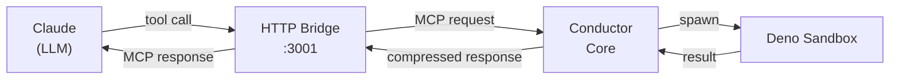
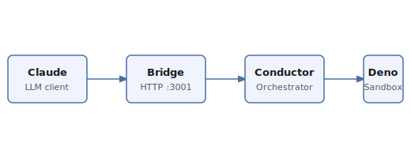

# MCP Conductor: Request Flow Overview

MCP Conductor sits between Claude and your configured MCP servers, acting as an intelligent
orchestration layer. Rather than Claude calling each MCP server directly and receiving raw JSON
responses that consume large amounts of context, Conductor intercepts those calls, executes the
work in a sandboxed Deno environment, and returns a compact summary.

## How a Request Flows

When Claude issues a tool call, the request travels through several layers before any work is done.
The diagram below shows the happy-path flow for a typical `execute_code` invocation.

## The Sandbox

Every code snippet Claude asks Conductor to run is executed in an isolated Deno process. The sandbox
enforces strict resource limits: memory is capped, network access is restricted to an explicit
allowlist, and file-system access is limited to a temporary working directory that is cleaned up
after each run.

## Token Savings

Because the raw output of a tool call (JSON arrays, verbose logs, large data payloads) is never
sent back to Claude verbatim, the context window stays lean. Conductor compresses results to a
structured summary. Typical savings range from 88 % for small payloads up to 99 % for large ones.

## Architecture at a Glance

The diagram below (hand-authored) shows the high-level component map.

## Getting Started

Install Conductor globally with `npm i -g @darkiceinteractive/mcp-conductor`, then add it to your
`~/.claude/settings.json` under `mcpServers`. Restart Claude and you are ready to go.
