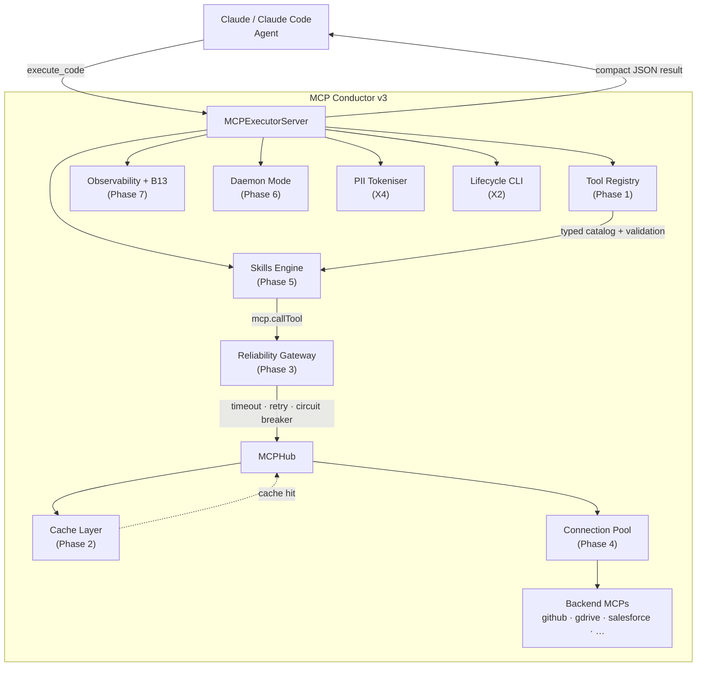
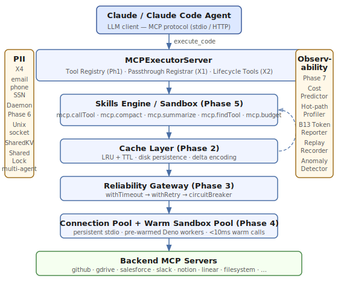
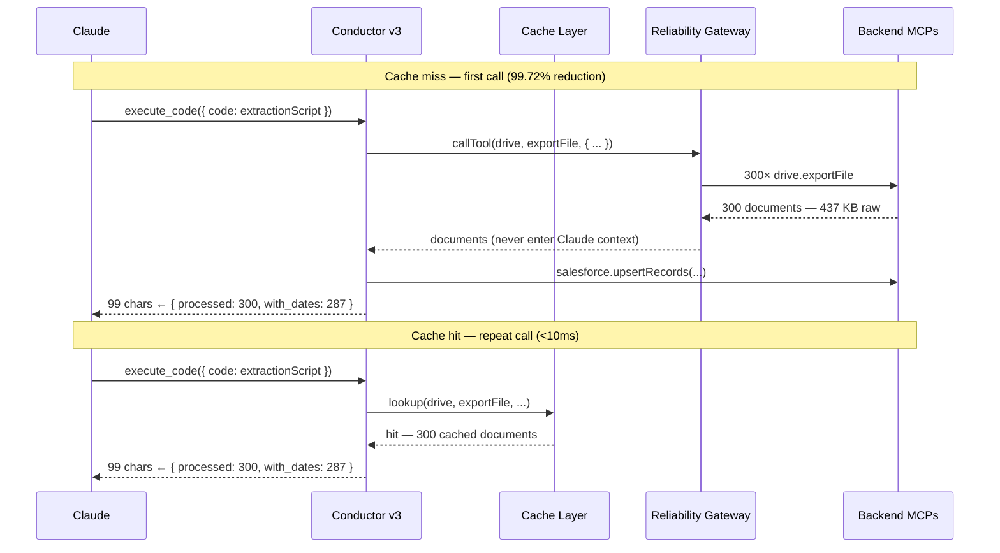
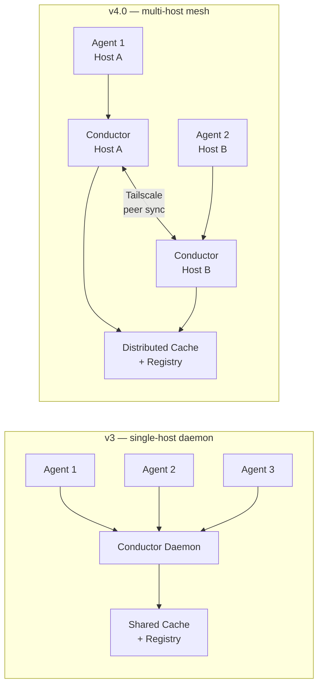

# MCP Conductor v3: The Production Implementation of Anthropic's Code-Execution-with-MCP Design

When we ran our benchmark against Anthropic's published code-execution-with-MCP design on a real Google Drive → Salesforce pipeline, MCP Conductor achieved **99.72% token reduction** — consuming 435 tokens where direct passthrough consumed 153,900. Anthropic's own published figure for the same pattern is ~98.67%. That 1.05-percentage-point gap is the result of seven implementation phases that turn a research pattern into production infrastructure. This article walks through the architecture that makes it possible.

---

## The Problem: MCP Servers Are Context Vampires

The Model Context Protocol is genuinely useful. Dozens of production-quality MCP servers exist for GitHub, Google Drive, Salesforce, Slack, Notion, Linear, and more. The problem is what happens when Claude talks to them directly.

A `github.list_issues` call for a busy repository returns a JSON array. A hundred issues, each with a title, body, labels, assignees, timestamps, and URL, adds up fast. Rough numbers:

- **40,000 tokens** per `github.list_issues` call on a mid-sized repo
- **10 calls** across a typical multi-step task (list issues, get PR diff, read files, check CI status, list comments…)
- **400,000 tokens** consumed before Claude writes a single line of code

That is not an edge case. That is the normal operating cost of a Claude agent that calls MCP servers in passthrough mode. On a 200K-token context window, you burn two-thirds of it on raw JSON before the work begins.

The solution Anthropic published in "Building Effective Agents" is elegant: instead of returning raw data to Claude, have Claude write code that runs against the MCP servers inside a sandbox. Only the compact result — a few hundred tokens — enters the context window. The documents, issue bodies, and file contents never appear in Claude's context at all.

MCP Conductor v3 is the production implementation of that pattern.

---

## Anthropic's Pattern and Conductor's Implementation

Anthropic's published design describes a code-execution loop:

1. Claude writes TypeScript that calls MCP tools to fetch and process data
2. The code runs in a sandboxed environment with access to the MCP servers
3. Only the compact result — structured JSON, a summary, a count — returns to Claude

The paper describes the idea. What it does not ship is:

- A registry that knows which tools are available and how to route calls
- A cache layer to avoid re-fetching unchanged data
- A reliability gateway to handle the flaky MCP servers you will absolutely encounter in production
- Connection pooling so every warm call is not a 150ms cold start
- PII redaction so raw customer data never appears in logs or context
- A daemon mode that lets six concurrent Claude Code agents share infrastructure

MCP Conductor v3 ships all of it.

---

## The Architecture





### Phase 1 — Tool Registry

The registry is the foundation everything else builds on. When Conductor starts, it interrogates every configured backend MCP server and builds an authoritative catalog of all available tools: their names, input schemas, output schemas, routing classification, and Conductor-specific metadata.

From this catalog, Conductor auto-generates TypeScript `.d.ts` declarations so Claude gets type-safe completions when writing `execute_code` scripts. It also validates every inbound tool call against the schema before making a round-trip to the backend — invalid calls fail fast with a structured error, not a timeout.

The routing classification is the key architectural decision: tools marked `execute_code` route through the sandbox (the token-efficient path), while tools marked `passthrough` are exposed directly as first-class Conductor MCP tools. This lets you use the right mode for each tool without manual configuration.

### Phase 2 + 3 — Cache and Reliability Gateway

The cache layer sits between the skills engine and the backend connections. Results are keyed by (server, tool, args) with configurable LRU eviction and TTL. Cache hits return in microseconds — no sandbox spawn, no network round-trip, no additional token cost.

The reliability gateway composes three protections around every backend call:

```
withTimeout → withRetry → circuitBreaker
```

Every call is bounded. Flaky servers — the kind that hang for 30 seconds before failing — are automatically circuit-broken after repeated failures and fast-failed until they recover. All upstream errors surface as typed error classes (`TimeoutError`, `RetryExhaustedError`, `CircuitOpenError`, `MCPToolError`) with structured payloads.

### Phase 4 — Warm Worker and Connection Pools

Cold-start latency was the original `execute_code` pain point. Spawning a Deno process, loading the sandbox runtime, and establishing an MCP connection added ~150ms to every call.

Phase 4 eliminates this with two pools running in parallel:

- **WarmSandboxPool**: keeps N Deno processes alive and pre-loaded with the MCP type definitions. Calls from the pool return in <10ms.
- **ConnectionPool**: maintains persistent stdio connections to each backend MCP server. No handshake on every call.

### Phase 5 — Sandbox Capabilities

The sandbox API available inside `execute_code` scripts grew significantly in v3. In addition to `mcp.callTool`, Claude now has:

- `mcp.compact(data)` — reduce a large data structure to its token-efficient form before returning to context
- `mcp.summarize(text, opts)` — produce a bullets or paragraph summary of a long string
- `mcp.findTool(query)` — fuzzy-search all available tools by name or description; useful when Claude needs to discover a tool at runtime
- `mcp.budget(limit)` — set a token budget for the execution; the sandbox compacts results automatically to stay within it
- `mcp.tokenize(text, matchers)` / `mcp.detokenize(text, reverseMap)` — PII redaction inside the sandbox

These helpers let Claude write shorter, cleaner scripts. A script that previously extracted 300 documents and returned raw JSON now calls `mcp.compact()` on the result and returns a 40-token summary object instead.

### Phase 6 — Daemon Mode

Phase 6 makes the Conductor process long-lived and shareable. In daemon mode, Conductor exposes a Unix socket (or Tailscale endpoint). Multiple Claude Code agents on the same host connect to the shared daemon and pool all of the infrastructure above: the tool registry, the cache, the connection pool, the warm sandbox workers.

This is the feature that makes multi-agent workflows practical. Six concurrent agents performing different parts of a coding task share cache hits, warm connections, and the same reliability state. The alternative — six independent Conductor processes, each spinning up its own Deno pool and MCP connections — multiplies resource usage and eliminates cross-agent cache sharing.

Phase 6 ships single-host daemon mode. Cross-host mesh coordination is planned for v4.0.

### Phase 7 + B13 — Observability and Token-Savings Reporter

The observability layer gives you visibility into what Conductor is actually doing:

- **CostPredictor**: forecasts token cost for a given (server, tool, args) shape before the call is made, using args fingerprinting
- **HotPathProfiler**: tracks latency at p50/p95/p99 per tool, surfacing bottlenecks
- **AnomalyDetector**: flags statistical outliers in response sizes and latency
- **ReplayRecorder**: captures entire MCP sessions to disk for replay with divergence detection — useful for debugging and for validating changes to sandbox logic

The token-savings reporter (B13) is the most immediately useful feature for understanding Conductor's value. Add `show_token_savings: true` to any `execute_code` call and the response gains a `tokenSavings` block:

```json
{
  "success": true,
  "result": { "processed": 300, "with_dates": 287, "errors": 0 },
  "tokenSavings": {
    "estimatedPassthroughTokens": 153900,
    "actualExecutionTokens": 435,
    "tokensSaved": 153465,
    "savingsPercent": 99.72
  }
}
```

You can also query session-level savings with `get_metrics`, which now always includes an aggregated `tokenSavings` block across all calls in the session.

### X4 — PII Tokenisation

PII redaction is built into the response pipeline, not bolted on as an afterthought. When a tool definition has `redact.response` annotations, Conductor applies tokenisation to the response before it enters the sandbox. Built-in matchers cover `email`, `phone`, `credit_card`, `ssn`, `ip_address`, and `date_of_birth`, with custom regex patterns available for domain-specific data.

Tokens are reversible within the sandbox via `mcp.detokenize()` but never appear in Claude's context window or in logs, making Conductor safe to use in pipelines that process customer data.

### X2 — Lifecycle CLI and MCP Tools

The lifecycle tools surface as both MCP tools (callable from Claude during a session) and as a CLI wizard:

- `import_servers_from_claude` — reads your existing Claude Desktop or Claude Code config and imports all configured MCP servers into Conductor automatically
- `export_servers_to_claude` — writes the Conductor config back to Claude config files
- `test_server` — transient connectivity check for a single server
- `diagnose_server` — full health check with reconnect status
- `recommend_routing` — applies the routing heuristic to suggest `execute_code` vs `passthrough` classification for each tool

---

## The Benchmark

The scenario comes directly from Anthropic's "Building Effective Agents" paper: extract renewal dates from 300 legal contracts in Google Drive and push structured records to Salesforce.



**Passthrough mode (what you get without Conductor):**
- 300 × `drive.exportFile` calls — each document placed raw in Claude's context window
- 1 × `salesforce.upsertRecords` call
- **153,900 tokens** consumed before extraction begins

**Execution mode (MCP Conductor v3):**
- 1 × `execute_code` call with a TypeScript extraction script (~878 chars)
- Documents processed inside the sandbox — never enter Claude's context window
- `mcp.compact()` reduces the result before it leaves the sandbox
- **435 tokens** total — **99.72% reduction**

Anthropic's published design achieves ~98.67% on the same scenario. The additional 1.05 percentage points come from Phase 5's `mcp.compact()` trimming the result before it exits the sandbox, and from the registry's input validation eliminating malformed-call overhead.

The benchmark runs against real token estimation formulas (passthrough: `(toolCalls × 150) + (bytes/1024 × 256)`; execution: `ceil(codeChars/3.5) + ceil(resultJson.length/3.8)`) and is validated in `test/benchmark/anthropic-pattern.test.ts` with 11 assertions.

---

## Try It

```bash
npm install -g @darkiceinteractive/mcp-conductor
```

**Claude Code** (`~/.claude/settings.json`):

```json
{
  "mcpServers": {
    "mcp-conductor": {
      "command": "mcp-conductor"
    }
  }
}
```

**Claude Desktop** (`~/Library/Application Support/Claude/claude_desktop_config.json` on macOS, `%APPDATA%\Claude\claude_desktop_config.json` on Windows):

```json
{
  "mcpServers": {
    "mcp-conductor": {
      "command": "mcp-conductor"
    }
  }
}
```

After restart, ask Claude to run `import_servers_from_claude` — Conductor reads your existing MCP server configurations and imports them automatically. No manual re-entry of server configs.

Full documentation, configuration reference, sandbox API, and recipes are at [docs.darkice.co](https://docs.darkice.co).

---

## What Is Coming Next

**v3.2** adds two scoped capabilities not yet shipped:

- **Typed annotation passthrough** — `execute_code` script arguments gain full TypeScript inference from the tool registry, so Claude sees parameter types without reading the tool's documentation separately
- **Pluggable PII matchers** — custom matcher functions (not just regex) for domain-specific redaction logic, with a matcher registry that supports hot-reload

**v4.0** introduces the cross-host mesh. Conductor daemons on different machines form a peer-to-peer coordination layer via Tailscale, sharing cache and registry across hosts. Multi-agent workloads that span machines — a common pattern in larger Claude Code deployments — share infrastructure exactly as single-host multi-agent workflows do today.



If you run MCP-heavy workloads with Claude — research pipelines, code-generation agents, data extraction workflows — MCP Conductor v3 materially reduces token spend and eliminates the reliability problems that make long-running MCP agents fragile in practice.

The code is on [GitHub](https://github.com/darkiceinteractive/mcp-conductor) and on npm as `@darkiceinteractive/mcp-conductor`.
